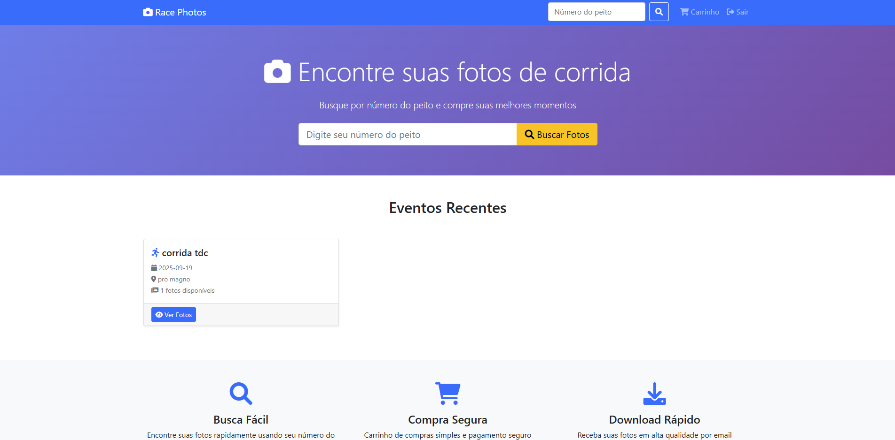
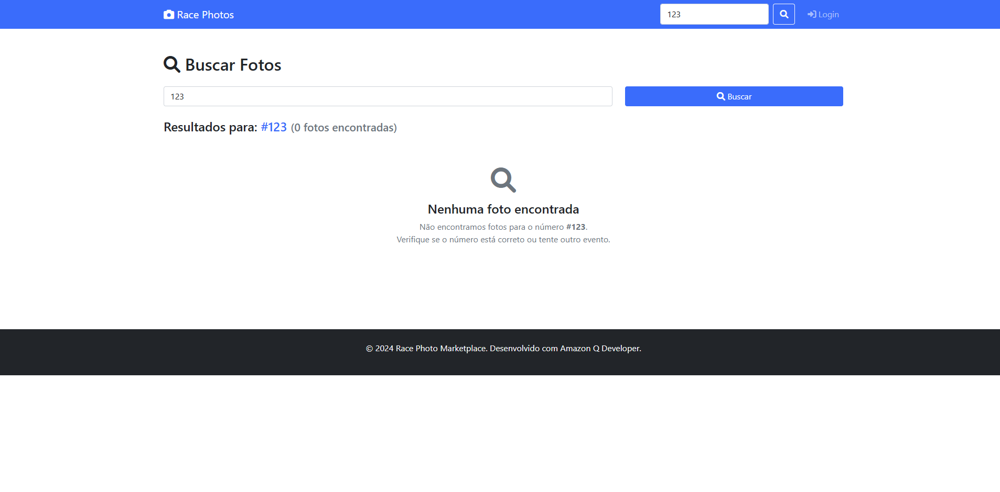
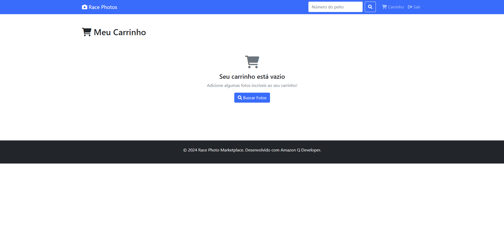
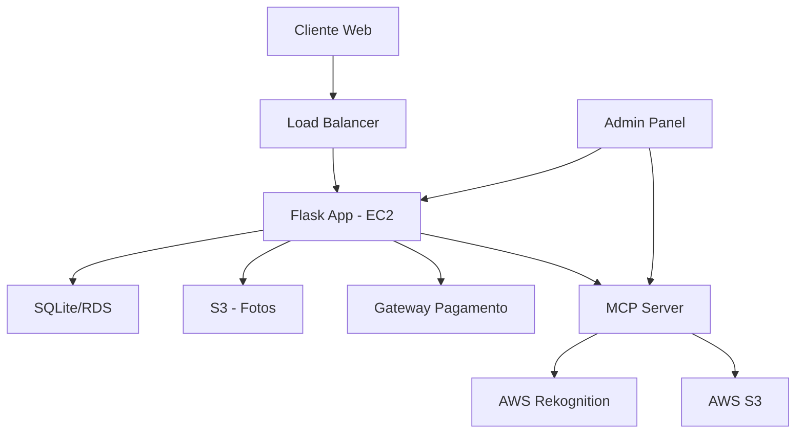

# Race Photo Marketplace 📸🏃‍♂️

## Qual problema inspirou a ideia

Como fotógrafo de corridas, identifiquei a dificuldade que corredores enfrentam para encontrar e comprar suas fotos após eventos esportivos. Muitas vezes as fotos ficam perdidas em galerias enormes, sem sistema de busca eficiente por número de peito ou nome do atleta. Além disso, o processo de pagamento e entrega das fotos costuma ser manual e demorado.

## Como a solução foi construída

A solução foi desenvolvida usando Flask (Python) com **MCP (Model Context Protocol)** para integração com AWS:

### Funcionalidades principais:
- **Upload inteligente de fotos** com detecção automática de números via IA
- **Sistema de busca** por número de peito do corredor
- **Carrinho de compras** para múltiplas fotos
- **Processamento de pagamentos** simulado
- **Painel administrativo** para fotógrafos
- **API REST** para integração com outros sistemas

### Funcionalidades MCP + AWS:
- **Detecção automática de números** usando AWS Rekognition
- **Análise de qualidade** das fotos
- **Upload para S3** (quando configurado)
- **Processamento inteligente** de imagens

### Tecnologias utilizadas:
- **Backend**: Flask, SQLite, Pillow (processamento de imagens)
- **MCP (Model Context Protocol)**: Integração com AWS Rekognition
- **AWS Services**: Rekognition (detecção de texto), S3 (armazenamento)
- **Frontend**: HTML5, CSS3, JavaScript vanilla
- **Pagamentos**: Simulação de gateway de pagamento
- **Deploy**: Preparado para AWS (EC2, S3, RDS)

## Instruções para rodar

### Pré-requisitos
- Python 3.8+
- pip
- Conta AWS (para funcionalidades MCP)
- AWS CLI configurado (opcional)

### Instalação
```bash
# Clone o repositório
git clone <seu-repositorio>
cd race-photo-marketplace

# Instale as dependências
pip install -r requirements.txt

# Configure AWS (opcional - para funcionalidades MCP)
aws configure

# Execute as migrações do banco
python src/app.py init-db

# Inicie o servidor
python src/app.py
```

O aplicativo estará disponível em `http://localhost:5000`

### Usuários de teste
- **Admin**: admin@example.com / admin123
- **Cliente**: cliente@example.com / cliente123

## Screenshots





## Próximos passos

1. **Integração com AWS S3** para armazenamento de fotos
2. **Implementação de pagamentos reais** (Stripe/PayPal)
3. **Sistema de notificações** por email/SMS
4. **App mobile** para corredores
5. **IA para reconhecimento facial** automático (já implementado via MCP)
6. **Sistema de watermark** dinâmico
7. **Analytics** para fotógrafos

## Prompts utilizados no Amazon Q Developer

1. "Crie uma aplicação Flask para venda de fotos de corrida com sistema de busca por número de peito"
2. "Implemente um sistema de carrinho de compras para múltiplas fotos"
3. "Adicione autenticação de usuários com diferentes níveis de acesso"
4. "Crie um painel administrativo para upload e gerenciamento de fotos"
5. "Implemente processamento de imagens com redimensionamento automático"
6. "Adicione testes unitários para as principais funcionalidades"
7. "Crie documentação da API REST"
8. "Configure estrutura para deploy na AWS"

## Arquitetura com MCP



## Funcionalidades MCP Implementadas

### 1. Detecção Automática de Números
- Upload de foto → MCP → AWS Rekognition → Números detectados
- Confiança mínima de 80% para aceitar detecções
- Fallback para entrada manual

### 2. Análise de Qualidade
- Avaliação automática da nitidez da foto
- Score de 0-100 para qualidade
- Rejeição automática de fotos de baixa qualidade

### 3. Upload Inteligente para S3
- Organização automática por evento
- Geração de URLs públicas
- Backup automático na nuvem

## Estimativa de custos AWS (mensal)

- **EC2 t3.micro**: $8.50
- **S3 (100GB)**: $2.30
- **RDS t3.micro**: $15.00
- **CloudFront**: $1.00
- **Route 53**: $0.50
- **Total estimado**: ~$27.30/mês

## Tags
`q-developer-quest-tdc-2025` `flask` `photography` `marketplace` `aws`